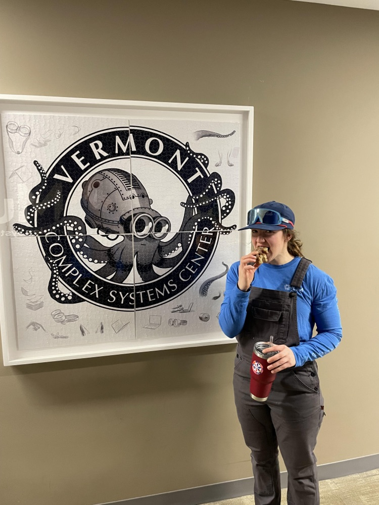
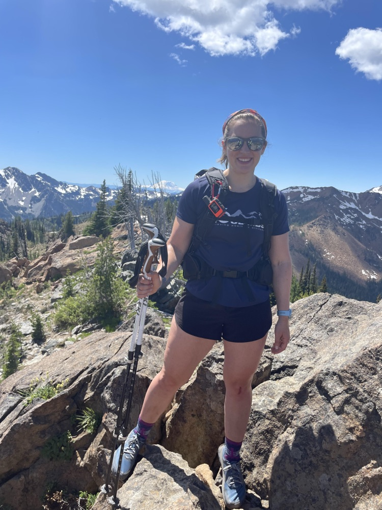
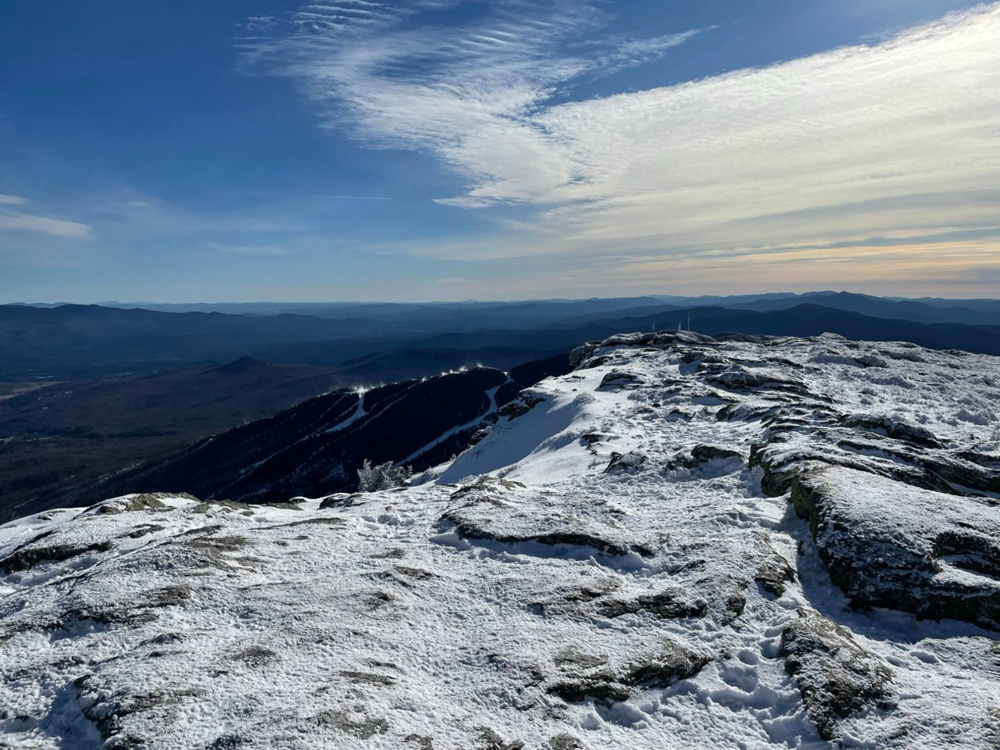

I am a Vermonter through and through. I grew up in Northern Vermont and got my Bachelor of Science in Mathematics at Saint Michael's College. After graduating, I jumped right into my graduate studies at the University of Vermont in the Mathematical Science Ph.D. program and the Vermont Complex Systems Center.

When I am not at my laptop or reading papers, you can find me either in the mountains, where I am hiking or skiing, or at a Crossfit class.

## Personal Interests

* Mountain adventures (skiing, hiking)
* Science fiction reading
* Medical TV dramas

::: {.about-photos layout-ncol="2"}
{fig-alt="Mariah standing next to the Vermont Complex Systems Center logo"}

{fig-alt="Mariah on a rocky summit with snowy mountains behind her"}
:::

::: {.about-photos .about-wide}
{fig-alt="Snow-covered rocky summit of Mount Mansfield with ski trails and rolling mountains below"}
:::

```{=html}
<style>
.about-photos { max-width: 640px; margin: 2rem auto 0; }
.about-photos img { border-radius: 8px; aspect-ratio: 3 / 4; object-fit: cover; width: 100%; }
.about-wide { margin-top: 1rem; }
.about-wide img { aspect-ratio: 4 / 3; }
.about-photos figcaption { text-align: center; }
</style>
```
